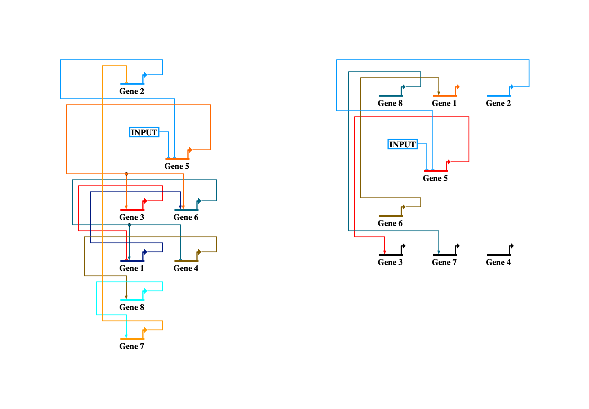

# Usage Instructions
NOTE: Do not rearrange the provided files; they are required to have a specific relative path to each other, so rearranging them will break the code. Feel free to place the overall folder wherever you wish however.

##### What you need

	- Biotapestry (http://www.biotapestry.org/): For visualizing/editting gene regulatory networks
	- Python 3.x

##### Rules of the Game

At the beginning of the game, players will all be given a partially complete gene regulatory network.
This network includes a lot of feedback mechanisms and is heavily intertwined: gene products act as regulators
on the other genes of the network. There are 5 types of regulation: Single repression, Single activation,
double repression, double activation, or both a repressor AND an activator. These types of regulation follow
the dynamics described in the equations below.

[insert equations]

In the network given to players, some of the regulators will be missing. 
Players will be given a set budget at the beginning of the game ($10,000 to $15,000). They will use this money to purchase 
experiments. It is their challenge to use this money wisely to collect the data they require to
determine the missing connections in the network. Descriptions of the available experiments and their costs are given in the
experiments.md file. This data will have noise and it will have error, as all experiments do.

##### Generating A Model
In order to generate a model, you will run `GetModel.py`. I have created a helper file called `make_model.py` that makes this process easy. Open this file (`make_model.py`), and there will be some comments describing some options you have to set certain features of the model. When you are satisfied with these, run the script. You might have to run it multiple times to generate a model that is sufficiently interesting. 

This will create a biotapestry file and antimony file in your current working directory. Hold on to these. It will also create `tmax.txt` in the working directory. This file should not be edited or deleted.

##### Breaking the model
In order to break the model, first open the BiotapestryEditor program. From there, click File > Import > Import Full Model Hierarchy from CSV and select the biotapestry CSV generated in the previous step. This will give you a visualization of the model, and from here select which connections to remove. Deleting the connections off the Biotapestry file will not work, as Biotapestry does not support this. 

As such, we have written our own code for removing/adding connections, found in `change_biotapestry.py`. I have written a helper file called `break_model.py` that includes instructions for breaking the model. This will output a new CSV of the form `model_name_broken.csv`, and you can view it in the BiotapestryEditor if you like.

I recommend this to be the file you give to the students.

##### Ordering Experimental Data
To collect data orders from students, we have created a google form: [BIOEN 498: Experiment Request Form](https://docs.google.com/forms/d/1OFsoRf8hEJw4d3bpdQHlR1wrq_fUVGD6PmKRf3d1TdY). 

Update the team names on the google form if necessary, and when creating the score file (step 3 below) make sure these team names match those in the score file.

Students can be given the following link to fill out the form: [LINK](https://goo.gl/forms/tNdhQsd37YHjuPTJ2). They will need to be logged into their UW Google account.

1. Download csv from google forms
2. Unzip csv into the same directory as `run_experiments.py`
	* **DO NOT** clear the old experiment orders from the CSV, or modify it in any way. The code handles this for you. Just make sure you overwrite the old CSV.
3. Run `get_data.py` (make sure the `num_genes` parameter in this file is the correct number of genes in the network. Currently set to 8.)  
	* NOTE: the first time you run this, it will generate a CSV to keep track of how much money each team has. Open `get_data.py` and make sure the team names in top section match those on the google form.

The students will then be sent an email from `bioen498@gmail.com` containing the data they have ordered, and an update on how much money they have remaining. If a student tries to order experiments they do not have the money for, they will receive no results.

##### Final Notes
  * While playing the game, we generated a list of assumptions we had to make about the network. 
	  This list is stored in `assumptions.md` in the main folder. It might be worthwhile to provide this list, or a subset of it, to the students as I think it may help answer some common questions.
  * `experiments.md` stores the list of experiments, including their descriptions and costs.
  * The `playing_game` folder stores all the material we used when playing this game. This includes 
	  a lot of code we wrote for filtering through our broken model, estimating parameters, attempting to find missing connections, and whatnot. We also included a file called "`what we think`" where we documented our general strategy.

# Function Descriptions
  * (see documentation in files for more details)

### Main Folder

##### `GetModel.py`
Allows you to randomly generate a gene regulatory network that meets certain criteria. Has functions for converting this network to an antimony string or to a 
CSV format that Biotapestry can read. Returns a tuple (`antimony_string, biotapestry_string`) and can also has an option to export this information to files in the working directory
Relevant functions:
  * `get_model()`
  * `convert_to_antimony()`
  * `convert_to_biotapestry()`

##### `Biotapestry.py`
Contains the method `convert_biotapestry_to_antimony` which is a convenience method for converting between the two formats. Since biotapestry does not store parameter values, you must provide these manually. 

##### `RunModel.py`
Allows you to run a model (generated using `GetModel.py`) and generate noisy "experimental" data from it. There are additional outputs that are turned off by default.
Relevant functions:
  * `run_model()`
  * `Output()`

##### `change_biotapestry.py`
Has methods for automatically adding and removing connections in a gene network
from a Biotapestry CSV format. Convenient for breaking gene network, or for
trying out new possible connections in attempt to fix the broken network.
Relevant Functions:
  * `add_biotapestry()` = adds the given connections to model
  * `remove_biotapestry()` = removes the given connections from model

##### `compare_biotapestry.py`
Compares two biotapestry CSV formats and outputs their differences.
Might be useful for assessing how well students captured the true network
at end of quarter

##### `run_experiments.py`
Given the csv from google forms, will parse through and run the correct experiments for each entry. Will update the team's money and send email with the csv of the experiment results to the student who filled the form.

##### Other
  * `assumptions.md` = list of assumptions made about the true network when playing the game. We tried to capture all the information we felt the students might need to fairly play the game
  * `experiments.md` = list of available experiments and pertubations, as well as their costs

### Playing the Game Attempt folder

##### `data_analysis.py`
Used to make sense of experimental data. This includes parameter estimation, and probing for possible missing connections.

##### `the_game.py`
Plots current working model vs experimental data to help spot shortcomings in current model. Helps us manually decide which connections to consider, and which tests to order.

##### Other
  * `what we think.md` = describes the strategy we used while playing the game
  * `model_files` = all the experimental data we bought
